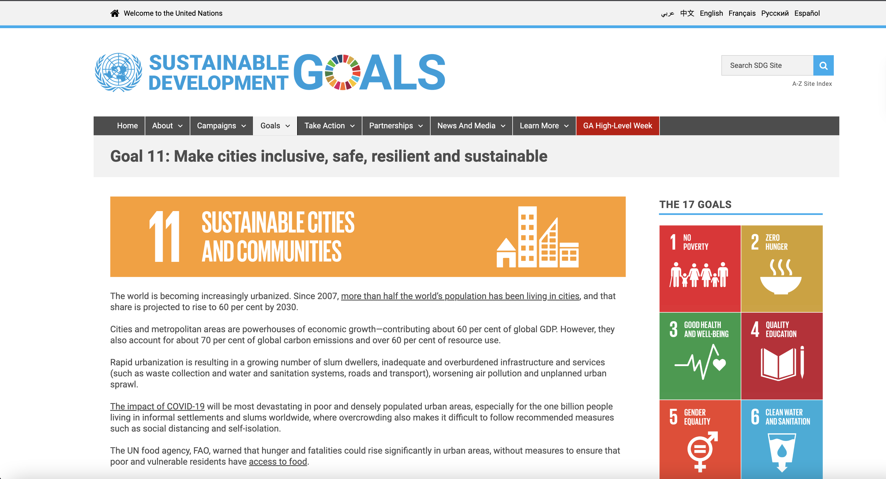
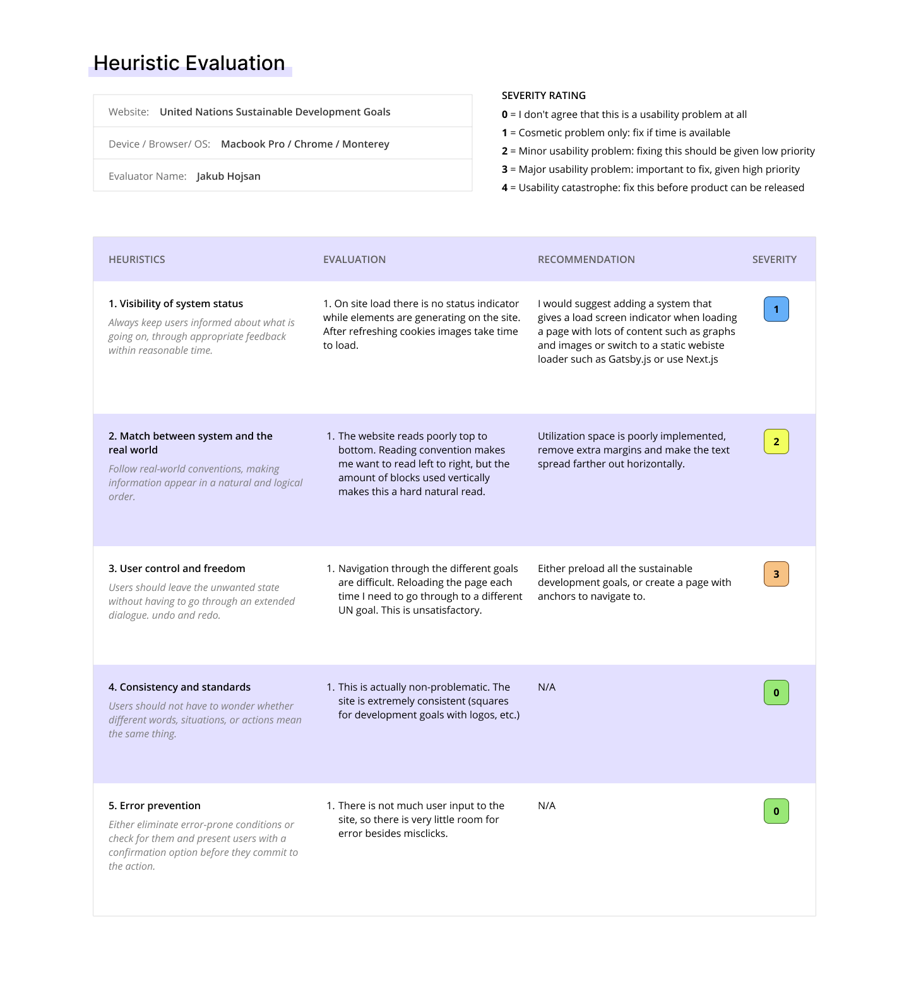
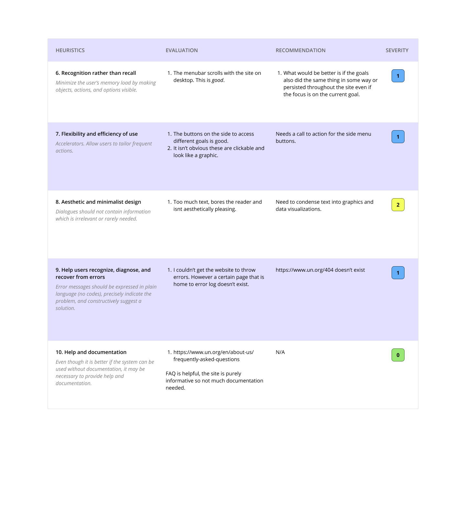
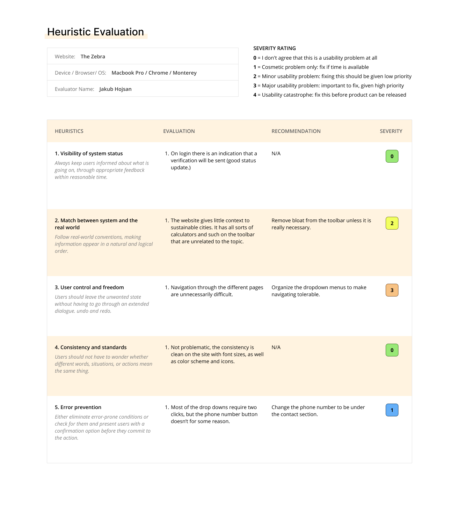
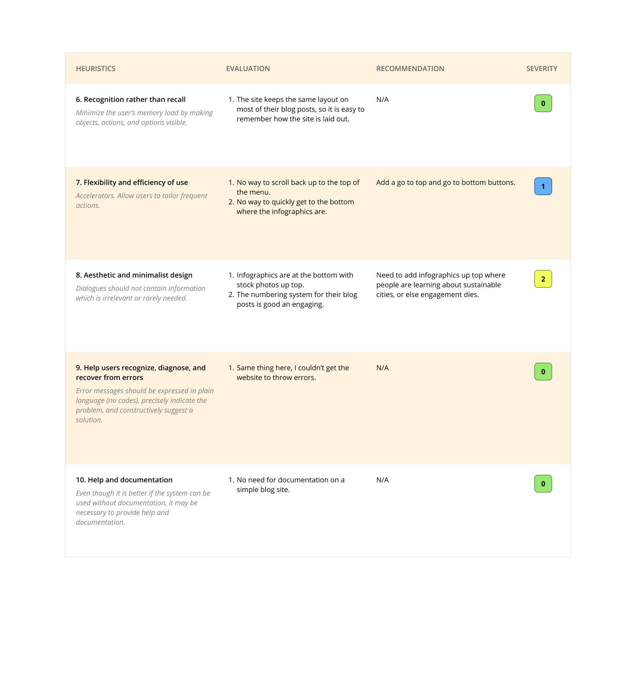

# DH110-22F

## Sustainable cities and how we can contribute.

### Summary

During the course of this project I would like to highlight the best ways for people to contribute to developing a sustainable city, as well as imform the end user of what sustainable cities could look like in addition to their benefits. According to the United Nations, nearly half of the world's populations live in urban settings, with nearly sixty-percent living in these same areas by 2030.

Currently, sites that try to inform the user of what they can do/inform the user what sustainable cities are all about are verbose and lack conciseness. I hope to remedy this through rigorus analysis, and find ways to create my own design based on *Heuristic Evaluation*.

[UN Site for reference.](https://www.un.org/sustainabledevelopment/sustainable-consumption-production/)

## Evaluation #1

### Background Information
The United Nations put out a list of sustainable goals to better our planet/humanity (both culturally and enviormentally.) While the site is the originator of these ideas does not mean the site is without flaw. 

### Overall evaluation
Generally this is an _okay_ informational site. It has some missing and poor design elements hiding about, but it is expected for a nonprofit orginzation.

## Evaluation #2

### Background Information
This website is also primarily an imformational one, but it focuses on _what_ a sustainable city is rather than suggest ways to create a more sustainable city yourself.

[The Zebra for reference.](https://www.thezebra.com/resources/home/what-is-a-sustainable-city/#infographic)

### Overall evaluation

The site is better than above, but clearly has narrower focus. It isn't a site dedicated to sustainable cities, but had too much good sustaible city content to not try to critique the design via heuristic evaluation.

