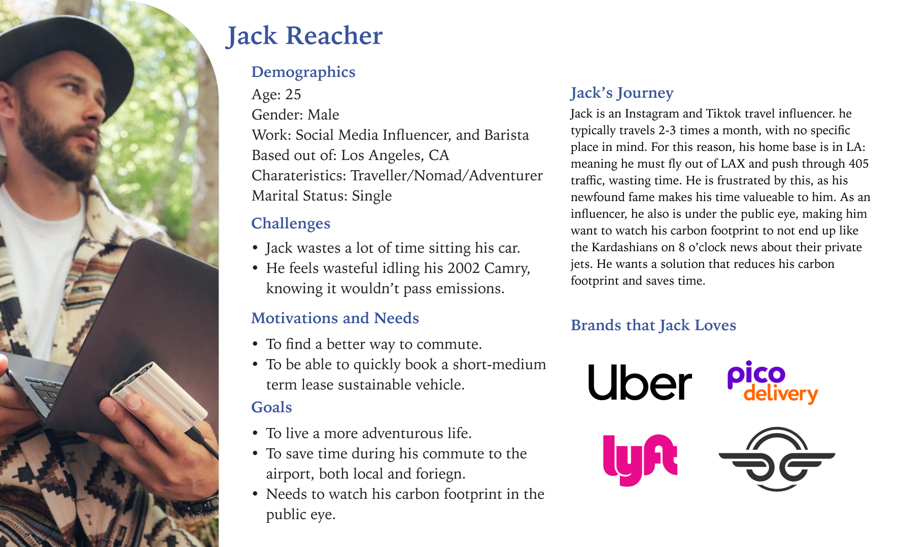
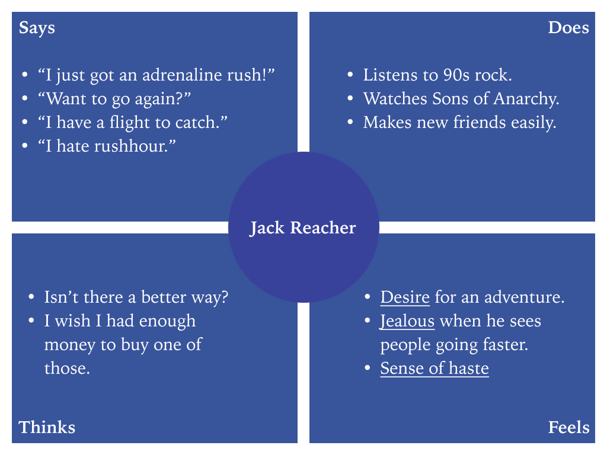

# Personas + Usage Scenarios

## Personas and Empathy Maps
### Persona: Jack Reacher, Digital Nomad

### Empathy Map: Jack Reacher, Digital Nomad

### Persona: Kevin Underwood, Angry Businessman

### Empathy Map: Kevin Underwood, Angry Businessman

## 🌎 Scenarios and Journey Maps
### Feature #1
Rent a electric motorcycle for a specified duration/number of miles.
### 1. Why is Kevin using this product?
> Kevin feels like he is wasting time in his commute to the office anytime he has to head out for his job as a venture capitalist. Uber's always somehow show up late, and then he gets stuck on the 405 for nearly an hour. Slowly over the period of a few months, he feels like he might go crazy if he has to converse with another loon driving him around. His associates have started to ridicule him for being late. Not only that, but they also criticize him for never using Uber Pool (why would he want to get stuck with more strangers?) The critique is valid however, as his carbon footprint is increasing with every ride he does solo. Yet he really doesn't care about that, he only cares about getting to the office quick.
### 2. How is Kevin using this product?
> Kevin gets a call from a client that has discovered an extrodinary app that helps patch all Kevin's pain points. His client tells him about an app called Zero, an app that allows users to rent EV motorcycles that are actually faster than gas operated ones. He uses it in foreign contries and domestically alike to get to his destinations quicker, and with no carbon footprint. Kevin downloads Zero, and opens the application. He is greeted by a brief survey to gauge his use cases, and selects an option for 'daily rental'. He now has the option to decide how he wants to pay, whether per mile or per day. Since Kevin just needs to get to the office 20 miles away (everyday), the decision is easy. After 20 minutes, he reaches Bain Capital with time to spare for coffee.
### Journey Map: Kevin

### Feature #2
View your negative carbon emissions and share to your network.
### 1. Why is Jack using this product?
> During his time in Thailand, Jack realized how many people in the country use scooters to get around. "Wow, they really waste no time around here," he thinks. Back home, Jack would always get stuck on the 405 with no other quick options during his weekly travel trips for his vlog. His viewers clearly see his distressed on his vlogs, nearly missing his flight on every episode. His viewers criticize him for idling so often in traffic, why doesn't his new car have an auto idle switch already? This along with his wasteful airline C02 emissions are not helping his case. He needs a soltion that primarily gets him around quick, but also appease his viewers on the platform with his C02 emmissions.
### 2. How is Jack using this product?
> Jack gets a call from an another travel influencer that has discovered an amazing app during his time in Thailand. The scooter culture was so strong out there his friend decided to look for a rental, but he ran into a brand called "Zero." The platform allows you to not only rent EV motorcycles with zero emissions, but also share your negative carbon emissions to social media apps and directly to his viewers to show them it is cool to stay carbon neutral/negative. Jack downloads Zero, and is able to quickly get to LAX in time for his own flight to Thailand. He is able to share is progress with his viewers via Twitter, with a super cool .png export of his statistics. 

### Journey Map: Jack

