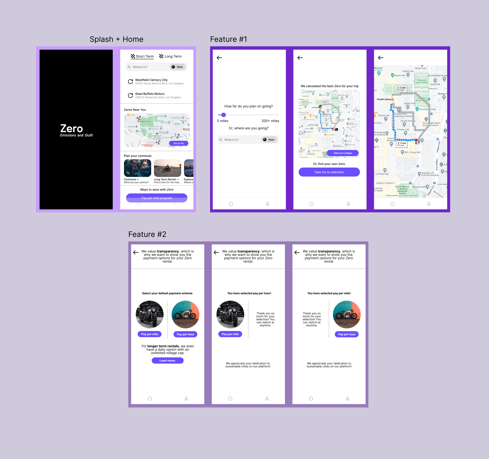

# Assignment 5: Low Fidelity Mockup

### Jakub Hojsan, DH110 F22

## Brief Introduction

### Overview

The purpose of this low fidelity prototype is to ensure that the features proposed are navigated properly by the user, and to adjust expectations based on my target demographic.

### Tasks implemented

* Task 1: Find a nearby Zero motorcycle and route to a location.
* Task 2: Change the payment scheme from pay per hour to pay per mile and vice-versa.

### How were these features decided?

These basic features were decided by taking a look at similar commuter applications, as well as user feedback from assignment 3/4 one step up in this repository. 

### A brief preview of the wireframes.

## List of features/tasks

## States/testing

## Changes

