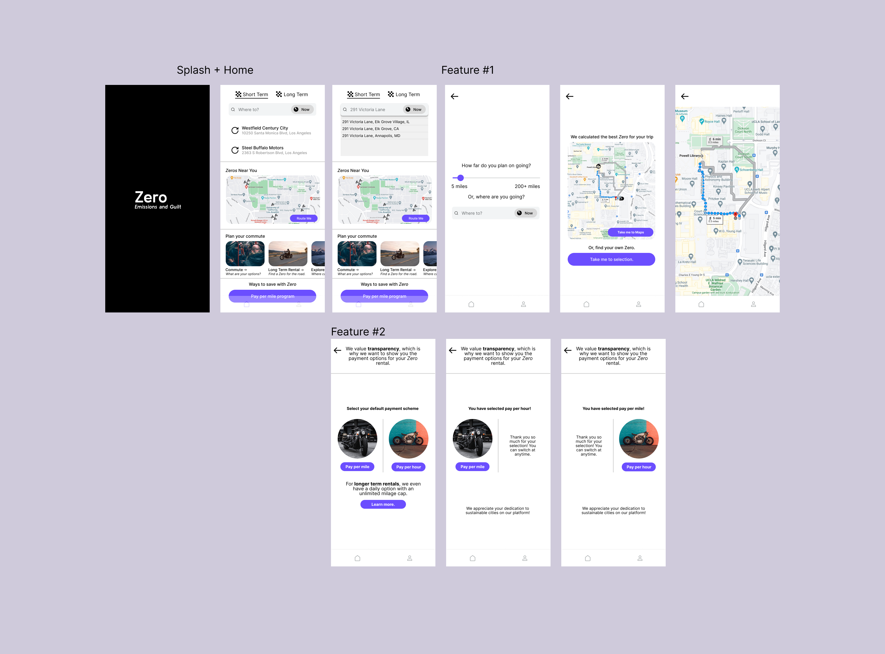

# Assignment 5: Low Fidelity Mockup

### Jakub Hojsan, DH110 F22

## Brief Introduction

### Overview

The purpose of this low fidelity prototype is to ensure that the features proposed are navigated properly by the user, and to adjust expectations based on my target demographic.

### Tasks implemented

* Task 1: Find a nearby Zero motorcycle and route to a location.
* Task 2: Change the payment scheme from pay per hour to pay per mile and vice-versa.

### How were these features decided?

These basic features were decided by taking a look at similar commuter applications, as well as user feedback from assignment 3/4 one step up in this repository. 

### A brief preview of the wireframes.

## States/testing

The link to the testing video can be found [here.](https://drive.google.com/file/d/1ynzOnPgCBs_7u5iXyNS6m_GVWwIsUHxL/view?usp=sharing)

## Participant Struggles

I noticed a few things when going through the UI/UX with my participant.
* The top search bar is the first thing she navigated to when I asked her to route herself to a location. I guess that the higher up the element is the higher precedent it has. 
* She thought the route me button allowed her to route her using the top search bar, when it was in fact a different element. This is something I didn't forsee.
* The back button at first may have indicated that she go back multiple steps, which is bad UI/UX practice.

## Flow Diagram as drawn by the participant

## Adjustments to UI/UX given participant struggles

## Reflection

The wireflow testing process worked a lot different than I thought. I was anticipating my participant clicking exactly where I thought they needed to, and accidentally started guiding them in the direction I wanted. Instead of continuing this, I tried to just suggest similar actions to steer them in the right direction but took note of things they found and adjusted them in my mental model and added a frame due to their feedback. Allowing the participant to draw arrows without proper instruction was also a mistake, since the arrows came with intention but there were some strays.

I didn't want to ruin the participants intention so I let them stay.

The primary fix I found was adding a screen that allowed the user to search, which was my participants first idea when routing to a place, not the route me button.

I kept the route me button there for redundancy, and it still goes to the same screen otherwise!

