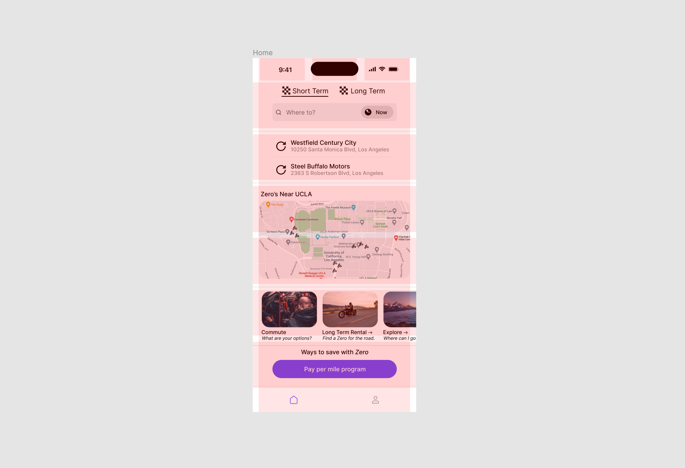
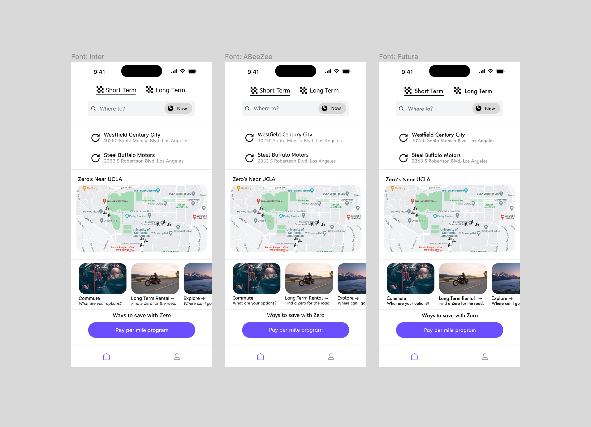
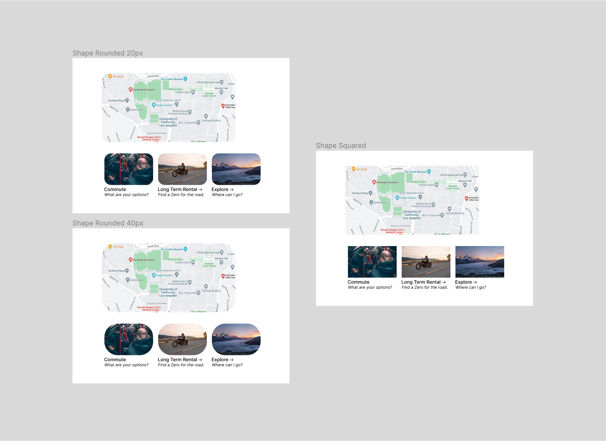
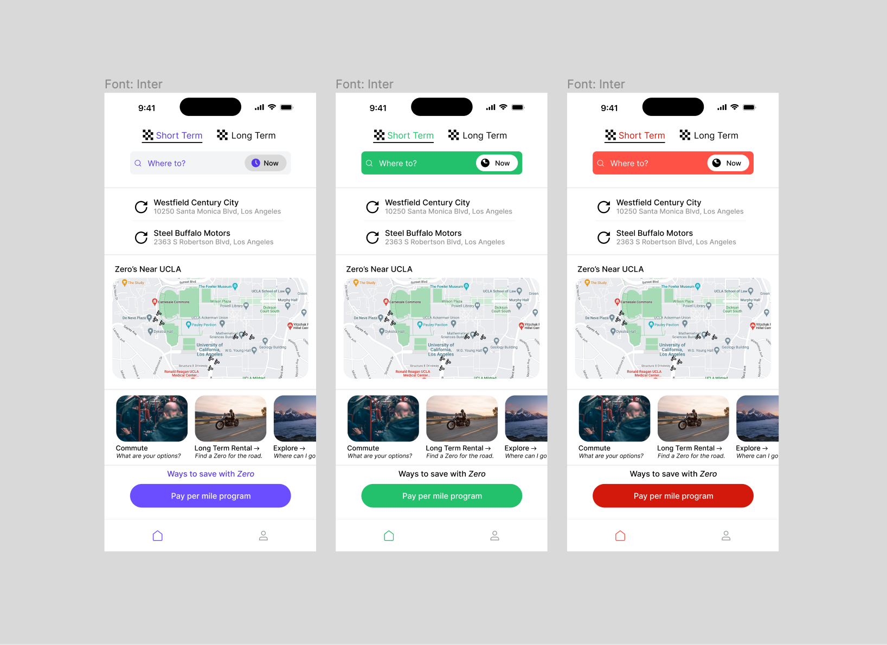

# Interface Design, DH110 Fall '22
### Jakub Hojsan

## Project Summary

## Links

## Gestalt Theory

We group elements due to law of proximity, and law of similarity.

The only rule we break is intentional, subtext is used in a gutter since the sizing of the element is undersized compared to the element above it (the map.)

I see that evidence of the layout test with proper spacing is a point on the rubric, but this is a statement that it looks better without passing this part of the spacing test so I left it as is.

## Design Variations

### Font Variation
I stuck with Sans Serif font variations since I wanted the site to be more casual and more in touch with modern UI/UX frameworks. The three options look similar but all convey a casual design rather than a professional one as highlighted in a Serif font. For sizes and headings I used a framework called Nucleus and kept their default sizing for these elements and changed the text. In my opinion other fonts felt culttered even as Sans Serif, which was also thought by my impression test participants. 

### Shape Variation

I wanted to go for a fluid feel, so I opted to try two different rounding pixel radii plus one square on some elements on my page (specifically the map and upsplash images on the bottom of the page that are horizontally scrollable.) A 20px and 40px rounding seemed like a big enough difference to test between, which was accurrate on the smaller images.

### Color Variation and Accessibility

## Descriptions of decison making process (style guide)

## Impression test

## Accessibility test

### Link to the interface design page that shows your test screens and design system information
