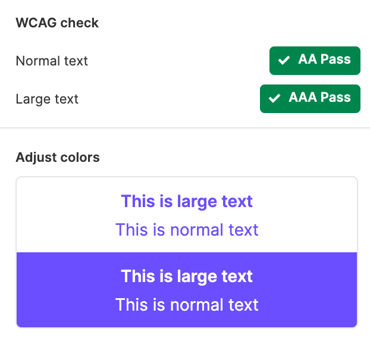
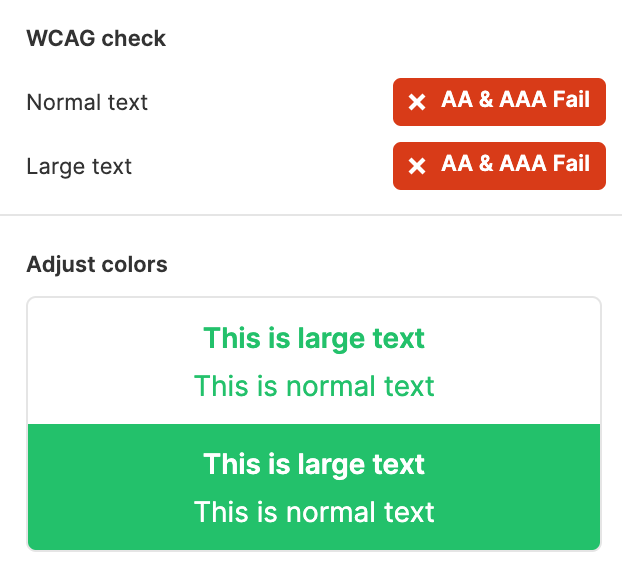
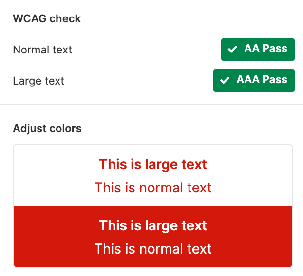
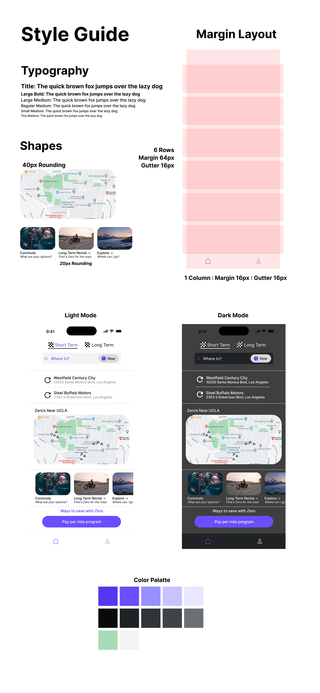

# Interface Design, DH110 Fall '22
### Jakub Hojsan

## Project Summary

Zero is a zero emissions electric motorcycle platform which allows users to rent short/long term motorcycles for their everyday needs. It allows you to pay per mile, day, or month. It aims to increase sustainable living within cities as highlighted as a UN Sustainable Development goal, to make all of us more conservative in our carbon footprint.

Wireframe and flow can be found [here](https://www.figma.com/file/E0lVkbu4lQ9bkhfn0V9jZc/Zero?node-id=0%3A1)!

### Purpose

The purpose of this assignment is to create a design library for future designs that adhere to good design standards, and follow theory such as Gestalt. Once we create a design library for our product creating a high fidelity prototype will come easier -- but also this serves as a tool to validtiate our design solutions one last time before the high fidelity concept.

### Process

The process for this was simple, since my low fidelity prototype was already drafted in Figma, I skipped the step of digitization as I already had a draft. After this, I followed key steps in Gestalt theory of grouping to reform elements and create proper spacing and gutters.

After this, I created variations in typography, color, and shape to refine what my design standards could potentially look like.

## Gestalt Theory

We group elements due to law of proximity, and law of similarity.

The only rule we break is intentional, subtext is used in a gutter since the sizing of the element is undersized compared to the element above it (the map.)

I see that evidence of the layout test with proper spacing is a point on the rubric, but this is a statement that it looks better without passing this part of the spacing test so I left it as is.

## Design Variations

### Font Variation
I stuck with Sans Serif font variations since I wanted the site to be more casual and more in touch with modern UI/UX frameworks. The three options look similar but all convey a casual design rather than a professional one as highlighted in a Serif font. For sizes and headings I used a framework called Nucleus and kept their default sizing for these elements and changed the text. In my opinion other fonts felt culttered even as Sans Serif, which was also thought by my impression test participants. 

### Shape Variation

I wanted to go for a fluid feel, so I opted to try two different rounding pixel radii plus one square on some elements on my page (specifically the map and upsplash images on the bottom of the page that are horizontally scrollable.) A 20px and 40px rounding seemed like a big enough difference to test between, which was accurrate on the smaller images.

### Color Variation and Accessibility (Accents only, look at design document for light versus dark mode one we select accents.)

While the colors of the site were generically white and black, it is good to test variations of accent colors to get some more color pop in the design. I chose a few key catching colors to test and checked accessibility/visiblity of the font colors on our primary colors.

  
### Accessibility  

  

## Selection of Style Guide

Based on the impression tests offically recorded as well as feedback from users that didn't get recorded, I landed on a combination of elements that best repersents Zero as a platform, as well as allowing it to be must accessible. 

The style-sheet can be found [here](https://www.figma.com/file/E0lVkbu4lQ9bkhfn0V9jZc/Zero?node-id=31%3A1008) as well as below.

## Impression test

I did several impression tests, but only one of them was recorded for time saving purposes. The first few allowed me to select the compnents for the style guide, while the final one that you will see was to validiate the final style sheet with the composed elements and digitized wireframe. 

The link to the impression test can be found [here](https://ucla.zoom.us/rec/share/Nkf8Uw1o__5PYfkFUp781fMqlBF3HG4V2ibIABLjk0TjgCIwm_M_ivAJ9NMrhxPc.-MjdGxSsszRgwnCg).

Some things that I took away from the impressions and changed based on feedback in the final style sheet:

* The color contrast in dark mode is poor on the search bar.
* Some of the splash photos look out of place.
* Even with context the design looks intentional, but text could be more descriptive in aggregate.

## Edits to the style sheet based on feedback

