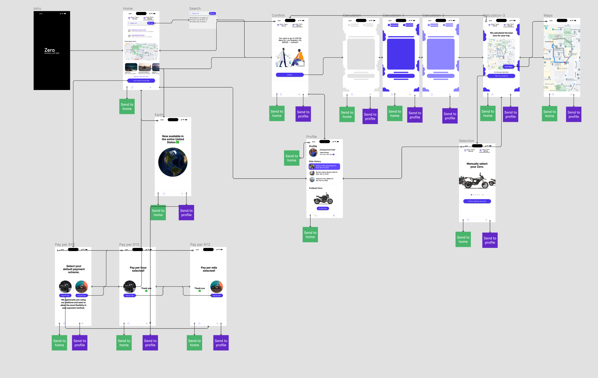

# DH110 High-fidelity prototype

### Jakub Hojsan

## What is the purpose of a high-fidelity prototype

The purpose of the high-fidelity prototype was to take the low-fidelity prototype and transform it into an interactive prototype one can interact with.

Zero is meant to be an application to rent electric motorcycles for short term and long term periods, hoping to contribute to the landscape of the sustainable city development goals posted by the United Nations. Electric motorcycles that the time (2022-2023) were not as accessible as an electric car. Following the lo-fi design, I added interactivity layers in Figma, as well as some animations :)

## Tasks that the prototype can handle

After the previous assignments, I had narrowed down usecases to these tasks:

- Being able to search for a location and route to it
- Changing your payment preference (miles versus hours)
- Select your prefered motorcycle
- View profile

## Wireflow

A link to this wireflow can be found [here](https://www.figma.com/file/E0lVkbu4lQ9bkhfn0V9jZc/Zero?node-id=84%3A1701&t=CrtslYbsi4rHXwuF-1).

## Prototype

The prototype can be found [here](https://www.figma.com/proto/E0lVkbu4lQ9bkhfn0V9jZc/Zero?page-id=84%3A1701&node-id=84%3A1709&viewport=464%2C411%2C0.27&scaling=scale-down&starting-point-node-id=84%3A1704)!

The source file in Figma can be found [here](https://www.figma.com/file/E0lVkbu4lQ9bkhfn0V9jZc/Zero?node-id=42%3A1823&t=CrtslYbsi4rHXwuF-1).

## Cognitive walkthough

A cognitive walkthrough was done during class, and what I found is that there were a few things missing, bit overall the users loved the look and feel of the product with a few reservations.

One of my users pointed out that the navigation bar was unclear, as the wrong colors were highlighted on ther menu bar on certain screens.

Alongside this, it was said that it was hard to return to the route selected if we accidentally clicked home.

And finally, both users said the map was unclear due to the UI being missing on the navigation sample.

I have updated the design to reflect this amazing feedback, and this is what we will be using going forward (the live links will update these changes.)
